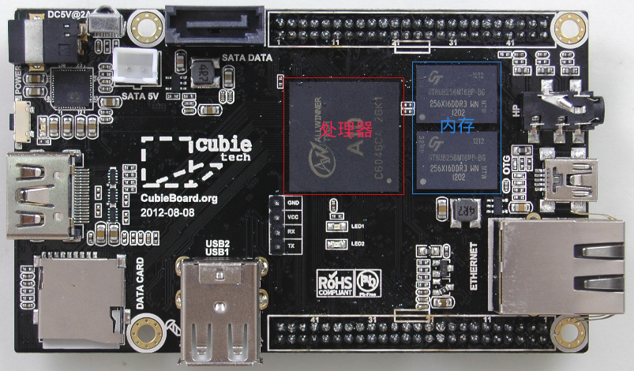

CUBIEBOOK - The missing cubieboard manual
=========================================

## cubieboard的硬件组成和接口情况

cubieboard的尺寸只有6x10厘米，但是从计算机的角度讲，它是一个完整功能的计算机。你可以认为cubieboard就是一个电脑主板，在主板上有处理器，有内存，有存储设备等等，和一般的电脑主机相比，它差的就是一个机箱。在性能上，cubieboard可以和90年代的PC媲美，不得不让人感叹半导体技术的进步。下面我们就来认识一下cubieboard上面各个部分。

* 处理器 - cubieboard的大脑-CPU使用的是珠海全志科技的A10芯片，A10是个名字，是全志公司自己取的，不代表其他任何意义。就像苹果把它的芯片叫A4，A5一样。A10芯片是基于英国ARM公司的cpu设计的。A10芯片内部不仅仅只包含CPU，还包含了GPU-图形处理器(你可以认为是集成显卡)，还包含了很多其他的控制器(你可以认为它集成了南桥北桥)。总之，芯片内部集成了很多东西 ，这就是为什么你看到电路板上和PC主板相比，很干净，没什么东西，并且尺寸那么小。

* 内存 - 不同于PC，cubieboard上的内存是不能插拔和替换的(因为体积小)，是直接焊在电路板上面的。cubieboard有两种内存规格512MB和1GB的，用户都倾向于买1GB内存的，所以现在512MB内存的cubieboard很少生产了。

* 电源插座 - cubieboard的电源输入电压是5V，电流根据系统不同负载(CPU是否忙，是否接入多个USB设备)
* 电源键 - 
* HDMI接口 - 